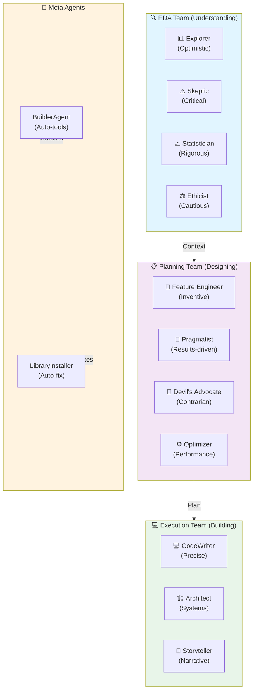
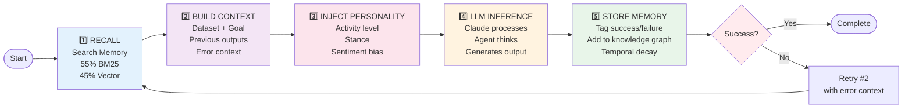
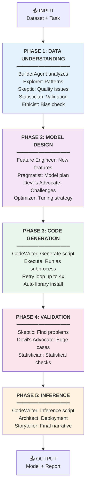
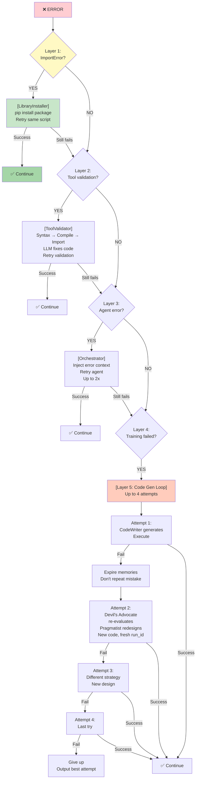
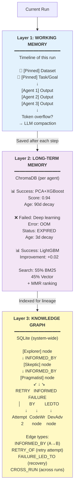
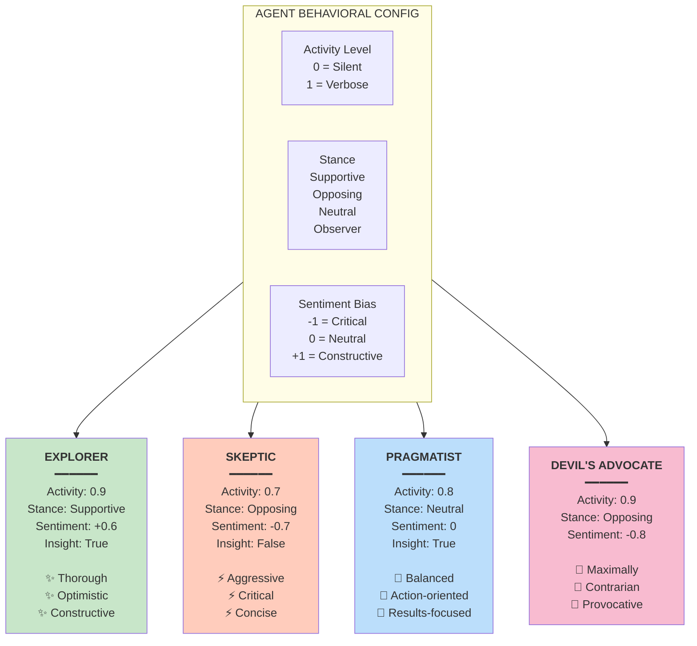
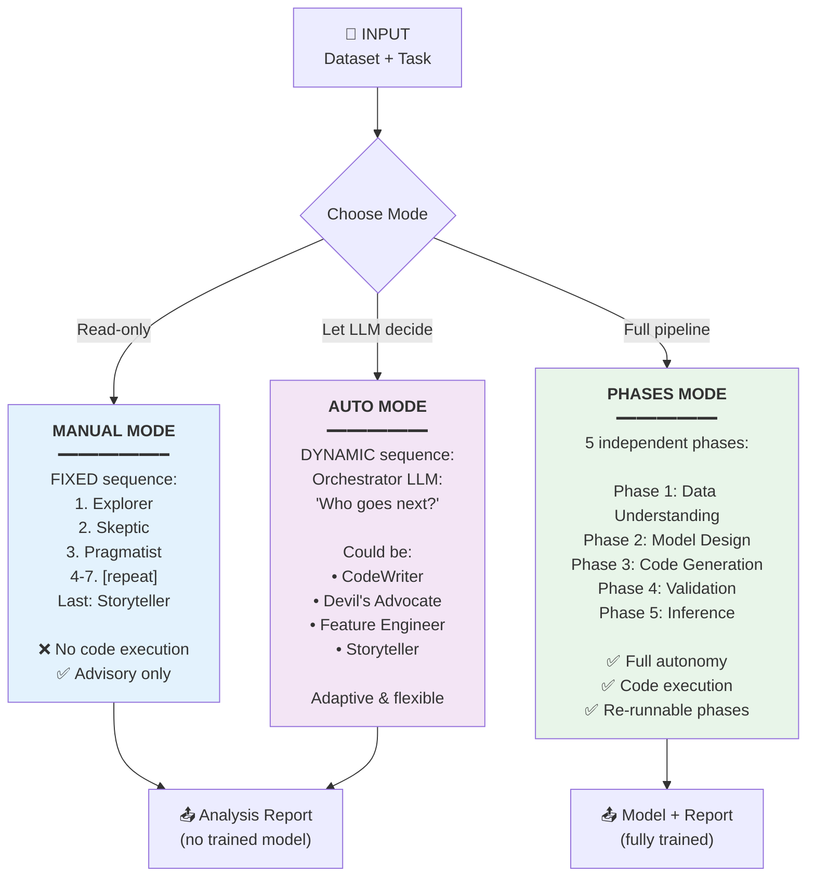

# Agent System - Mermaid Diagrams

## Agent Team Collaboration

## Agent Lifecycle

## Phase-Based Pipeline

## Retry Mechanism - Error Recovery

## Memory System - 3 Layers

## Behavioral Personality Space

## Orchestration Modes

